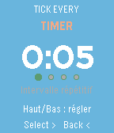
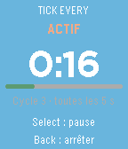
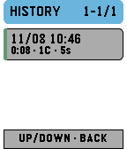
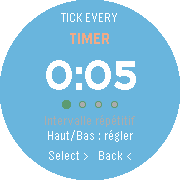

# Tick Every

<p align="center">
  
</p>

<p align="center">
  <strong>An endless repeating timer that tells you the cycle number through vibrations.</strong><br>
  Native, private and built for Pebble watches.
</p>

<p align="center">
  <a href="#english">English</a> · <a href="#français">Français</a>
</p>

---

## News

### 2026-08-12 — Phone history sync fixed / Synchronisation corrigée

Tick Every 1.2.1 fixes the mobile archive on the real Pebble mobile app: the
history snapshots sent by the watch were silently ignored, so completed
sessions never appeared in Configure. Nothing is lost — the watch keeps its 32
latest sessions and resynchronizes them on the next launch.

Tick Every 1.2.1 corrige l'archive mobile dans la vraie app Pebble : les
snapshots d'historique envoyés par la montre étaient ignorés et les sessions
terminées n'apparaissaient jamais dans Configure. Rien n'est perdu : la montre
conserve ses 32 dernières sessions et les resynchronise au prochain lancement.

### 2026-08-11 — Mobile archive and clearer haptics

The watch still keeps its 32 latest sessions, while the phone now merges them
into a local archive with no app-imposed session limit. Configure displays the
archive in pages of 32. Long vibrations now represent groups of five cycles,
and the quiet gap between pulses is longer so three or four short pulses remain
easy to distinguish.

### 2026-08-11 — Optional session history / Historique optionnel

Tick Every 1.1.0 adds an opt-in, local-only history of the 32 latest completed
sessions. It is available both on the watch (hold **Select** on the Timer
screen) and from **Configure** in the Pebble mobile app. Saving remains off by
default, and no statistics are sent to a server.

Tick Every 1.1.0 ajoute un historique local et optionnel des 32 dernières
sessions terminées. Il est consultable sur la montre (appui long sur **Select**
depuis l'écran Timer) et dans **Configure** depuis l'app mobile Pebble. La
sauvegarde reste désactivée par défaut et aucune statistique n'est envoyée à un
serveur.

See the full details in the [changelog](CHANGELOG.md).

## English

Tick Every repeats one interval until you stop it. At the end of each cycle,
the watch uses a numbered haptic pattern so you can keep count without looking
at the screen. An optional start delay gives you time to get ready.

There is no Tick Every account, analytics or advertising. The timer itself
runs entirely on the watch and does not need a phone or Internet connection.
English is the default interface language; French can be selected from
**Configure** in the Pebble mobile app. The same page can opt in to a local
session history and display it. The watch keeps the latest 32 sessions; the
phone archives every session it successfully receives, without an app-imposed
count limit. Opening that
hosted settings page requires Internet access, but the settings, timer and
watch history work offline afterwards.

### How it works

Watch setup is a four-step flow: **Timer → Delay → Haptics → Ready**. Set an
**interval**, an optional **start delay**, and whether numbered haptics are
enabled. Hold **Select** for 0.7 seconds to start.

Open **Configure** in the Pebble mobile app to change the watch language or
enable **Save session history**. Statistics are disabled by default. When
enabled before a session starts and still enabled when it stops, Tick Every
saves its end date, total and active durations, cycle count, interval, delay
and haptic setting. PebbleKit JS merges each 32-session watch snapshot into a
separate local phone archive, which Configure displays in pages of 32.

For a 10-second delay and a 5-second interval:

| Time | What happens |
| ---: | --- |
| 0–10 s | Silent start delay |
| 10 s | Two short pulses announce the actual start |
| 15 s | Cycle 1 — one short vibration |
| 20 s | Cycle 2 — two short vibrations |
| 25 s | Cycle 3 — three short vibrations |
| … | The timer continues until you stop it |

Cycles 1–4 use the same number of short vibrations. From cycle 5 onward, each
long vibration represents a group of five and short vibrations represent the
remainder: cycle 7 is **one long + two short**, and cycle 12 is **two long +
two short**. A 100 ms quiet gap keeps adjacent pulses distinct.

Numbered haptics can be disabled. The two short start pulses remain enabled so
you still know when the delay has ended.

### Controls and features

- **Up / Down:** change the current watch setting.
- **Select:** confirm a setting; pause or resume a running timer.
- **Hold Select:** start from the Ready screen.
- **Hold Select on the first Timer screen:** open session history; use Up / Down
  to browse and Back to return.
- **Back:** return to the previous setting, or open the stop confirmation while
  the timer is running.
- Repeating intervals from **1 second to 1 hour**.
- Optional delays of **0, 5, 10, 15, 30 or 60 seconds**.
- Phase-accurate elapsed time and cycle count, including after a late wake-up.
- Optional, local-only history: **32 recent sessions on the watch** and all
  successfully synchronized sessions in the paginated phone archive, with no
  app-imposed count limit.
- Persistent interval, delay, haptic, language and statistics settings.
- High-contrast layouts for rectangular, round, colour and monochrome screens.
- English and French interface; English by default.

### Screenshots

| Configure the interval | Follow the current cycle | Session history | Round display |
| :---: | :---: | :---: | :---: |
|  |  |  |  |

More states and platform variants are available in
[`docs/screenshots/`](docs/screenshots/). The illustrated user guide is
[`docs/tutorial.html`](docs/tutorial.html).

### Install a PBW

The simplest installation method is the Pebble Appstore. To sideload a build,
download `tick-every.pbw` from the latest
[GitHub release](https://github.com/G-Cyrille/tick-every/releases/latest), then
install it with a current Pebble SDK and `pebble-tool`:

```sh
pebble login --status
pebble install --cloudpebble /path/to/tick-every.pbw
```

The Pebble mobile app and the CLI must use the same Pebble Account, and **Dev
Connection** must be connected to CloudPebble. See the
[watch installation guide](docs/development.md#installation-sur-une-montre--workflow-2026)
for the complete workflow and the LAN fallback.

### Build and test

Prerequisites:

- a current Pebble SDK;
- `pebble-tool`;
- a C99 compiler for the host-side tests.

```sh
git clone https://github.com/G-Cyrille/tick-every.git
cd tick-every
./tests/run.sh
pebble build
pebble install --emulator basalt
```

`./tests/run.sh` compiles the portable timer and history logic with strict
compiler flags, runs more than **19,200 C assertions**, then checks mobile
configuration validation, history decoding, persistence and retry flows in
Node. `pebble build` builds every platform declared in `package.json` and
creates `build/tick-every.pbw`.

For UI work, inspect at least one rectangular colour target (`basalt`), one
round target (`chalk` or `gabbro`) and one monochrome target (`aplite` or
`diorite`):

```sh
pebble install --emulator chalk
pebble screenshot --emulator chalk screenshot-chalk.png --no-open
pebble logs --emulator chalk
```

The detailed emulator, hardware and regression-test workflow is documented in
[`docs/development.md`](docs/development.md).

### Architecture

Tick Every's runtime is a native C watchapp. A small PebbleKit JS component
opens the mobile language page and sends the saved choice to the watch through
AppMessage; it is not needed while a timer is running.

```text
src/c/tick-every.c      UI, state machine, persistence, scheduling and haptics
src/c/timer_logic.*     Portable interval, delay, cycle and haptic-code logic
src/c/session_history.* Versioned session records, CRC and serialization
src/pkjs/index.js       Mobile configuration, local archive and AppMessage
src/pkjs/config.html    Hosted language, statistics and history page
tests/                  Host-side C and PebbleKit JS tests
resources/images/    Pebble launcher icon
docs/                Development guide, tutorial and reference screenshots
store/               Appstore copy, artwork, screenshots and release material
```

The runtime derives elapsed time and cycle boundaries from `time_ms()` instead
of counting callbacks. If a callback is late, the display catches up to the
current cycle without replaying a queue of stale vibration patterns. Static
buffers and a small number of layers and timers keep the app compatible with
the tighter heap on Aplite.

Supported platforms: `aplite`, `basalt`, `chalk`, `diorite`, `emery`, `flint`
and `gabbro`.

### Contribute

Bug reports, feature ideas, translations and tested pull requests are welcome.
Don't hesitate to contact me with improvement ideas or feedback, however small:
the easiest way is to [open an issue](https://github.com/G-Cyrille/tick-every/issues/new/choose).

1. Search the existing issues, then use the appropriate
   [issue template](https://github.com/G-Cyrille/tick-every/issues/new/choose).
2. Fork the repository and create a focused branch.
3. Keep the platform constraints in mind and add tests for logic changes.
4. Run `./tests/run.sh` and `pebble build`.
5. For UI changes, attach before/after screenshots for rectangular, round and
   monochrome targets.

Read [`CONTRIBUTING.md`](CONTRIBUTING.md) for the full contribution workflow.

---

## Français

Tick Every est un timer répétitif sans fin. À chaque cycle, la montre encode le
numéro du cycle avec des vibrations : une vibration longue représente un
groupe de cinq et les vibrations courtes représentent le reste.
On peut donc suivre sa progression sans regarder l'écran.

Exemple avec un délai de 10 s et un intervalle de 5 s : double mini-vibration à
10 s, cycle 1 à 15 s, cycle 2 à 20 s, cycle 3 à 25 s, puis le timer continue
jusqu'à son arrêt manuel.

Le timer fonctionne sur la montre, sans compte Tick Every, analytics ou
publicité. Il n'a besoin ni du téléphone ni d'Internet pendant son utilisation.
L'anglais est la langue par défaut. La page **Configure** de l'app mobile permet
de passer en français et d'activer, si on le souhaite, l'historique local. La
montre conserve les 32 dernières sessions ; le téléphone archive toutes celles
qu'il reçoit, sans plafond de nombre imposé par l'app, et les affiche par pages
de 32. L'ouverture de cette page hébergée nécessite Internet ;
les réglages, le timer et l'historique sur la montre fonctionnent ensuite hors
ligne.

### Utiliser l'app

Le réglage sur la montre suit un parcours linéaire : **Timer → Délai →
Vibrations → Prêt**.

- **Up / Down** modifient la valeur affichée.
- **Select** valide ; pendant le timer, il met en pause ou reprend.
- Un appui long de **0,7 s sur Select** lance le timer depuis l'écran prêt.
- Sur le premier écran Timer, un appui long sur **Select** ouvre l'historique ;
  Up / Down le parcourent et Back revient au timer.
- **Back** revient au réglage précédent ou demande confirmation avant l'arrêt.
- L'intervalle va de **1 seconde à 1 heure**.
- Le délai peut être **0, 5, 10, 15, 30 ou 60 secondes**.
- Les vibrations numérotées peuvent être coupées ; le double signal de départ
  reste actif.
- L'historique est désactivé par défaut. Une session est enregistrée seulement
  si l'option était active à son démarrage et l'est encore à son arrêt manuel.
  Un arrêt pendant le délai ou une fermeture brutale ne crée pas d'entrée.
- L'historique contient la date de fin, la durée totale, la durée active, les
  cycles, l'intervalle, le délai et l'état des vibrations. À la 33e session,
  la montre remplace la plus ancienne ; le téléphone conserve les sessions
  déjà synchronisées.
- Les réglages et l'historique restent locaux à la montre et au téléphone :
  aucun compte Tick Every, serveur de statistiques ou cloud n'est utilisé.

Pour installer un PBW, développer l'app ou contribuer, suivre les sections
anglaises [Install a PBW](#install-a-pbw), [Build and test](#build-and-test) et
[Contribute](#contribute). Le guide technique détaillé en français est dans
[`docs/development.md`](docs/development.md).

## Project links

- [Appstore publication material](store/submission-checklist.md)
- [Publication runbook](store/PUBLISHING.md)
- [Illustrated user guide](docs/tutorial.html)
- [Changelog](CHANGELOG.md)
- [Contributing guide](CONTRIBUTING.md)
- [MIT license](LICENSE)
- [Official Pebble developer documentation](https://developer.repebble.com/)

Maintained by **G-Cyrille**.
